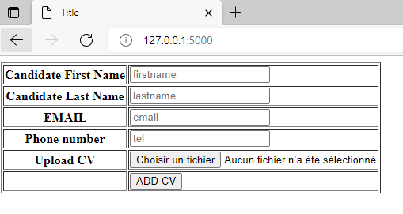

# DAAR-PROJECT-2
<div id="top"></div>
<!--
*** This is PROJECT 2 DAAR 'building a CV index and search application using python, flask and ELK
-->


<!-- TABLE OF CONTENTS -->
<details>
  <summary>Table of Contents</summary>
  <ol>
    <li>
      <a href="#about-the-project">About The Project</a>
      <ul>
        <li><a href="#built-with">Built With</a></li>
      </ul>
    </li>
    <li>
      <a href="#getting-started">Getting Started</a>
      <ul>
        <li><a href="#prerequisites">Prerequisites</a></li>
        <li><a href="#installation">Installation</a></li>
      </ul>
    </li>
    <li><a href="#usage">Usage</a></li>
    <li><a href="#logging">Logging</a></li>
    <li><a href="#contact">Contact</a></li>
  </ol>
</details>


<!-- ABOUT THE PROJECT -->
## About The Project

For Project 2, we decided to work with python and flask web plateform. This application enables us to:

* Index CVs of different candidates in Elasticsearch (Name, lastname, email, phone number and CV content)
* Upload the CV in its original format (doc, docx, pdf) in the internal folder
* Search Elastic search index using a search word to finally display all CVs that contain that certain search word in the CV content
* Display list of searched CVs with the possibility of downloading them in their original format
* Log all the important functions of the application using logstash in an Elastic search index created from logstash logs 


<p align="right">(<a href="#top">back to top</a>)</p>


### Built With
* [Python](https://python.org/)
* [Flask](https://flask.palletsprojects.com/en/2.0.x/)
* [ElasticSearch](https://www.elastic.co/fr/)
* [Kibana](https://www.elastic.co/fr/kibana/)
* [Logstash](https://www.elastic.co/fr/logstash/)
* [PyCharm](https://www.jetbrains.com/fr-fr/pycharm/)


<p align="right">(<a href="#top">back to top</a>)</p>


<!-- GETTING STARTED -->
## Getting Started

To get a local copy up and running follow these simple example steps.

### Prerequisites

* Python
* ELK
* Flask
* Pycharm
* logstash deps

### Installation


1. Start by downloading and installing python, Flask and ELK
* Have a running instance of ELK
* After installing python, install flask using pip
   ```pip install flask```
2. Install logstash and logstash python async
* Install JDK and logstash 
* then:
```pip install python-logstash-async ```
3. Install Pycharm IDE for python project
* Follow this link https://www.jetbrains.com/fr-fr/pycharm/download/#section=windows

<p align="right">(<a href="#top">back to top</a>)</p>


<!-- USAGE -->
## Usage

1. Start by opening the project in pycharm and running it 
2. The project will open in localhost:5601
3. The first interface is the index page which contains both options:
* ADD A NEW CV
* SEARCH CVs


4. In The "ADD NEW CV" Page we have a form that we can fill to add cvs to our instance



5. In the search page we can search using words such as 'java', 'cyber', 'php' etc 


6. after choosing the search word and clicking search, we get a result like the following


7. If no CV contain the searched word we get this


<p align="right">(<a href="#top">back to top</a>)</p>

<!-- LOGGING -->

In this project we configured logstash with the flask application and Elastic search so we can index logs in Elastic search and view them on Kibana.


<p align="right">(<a href="#top">back to top</a>)</p>


<!-- CONTACT -->
## Contact
This project was done by :
* AGREBI NOUR EL HOUDA - agrebinoor@gmail.com
* HOURI ORIANE - orianehouri@gmail.com 


<p align="right">(<a href="#top">back to top</a>)</p>


